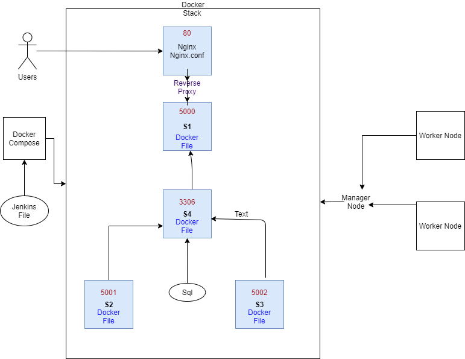

# Prize Generator

Author: Ayona Duncan

# Project Scope

A service-orientated architecture that randomly 
generates a prize depending on your account number that was generated 
and is composed of at least 4 services that work together.

**Service #1**

The core service – this will render the Jinja2 templates 
 that interact with the application, 
 it will also be responsible 
 for communicating with the other 3 services, 
 and finally for persisting some data in an SQL database.

**Service #2 + #3**

These both generate a random “Object”, that respectively generates a: 

- Random number

- Random letter

**Service #4**

This service creates an “Object” based upon the results of service #2 + #3 that allocates 50% of the cash prize if there is a 4 in your account number
and it starts with an A and 25% of the cash prize if you only have a 4 in your account number. 

# Architecture 

Architecture - Flow Chart:

**Service #2**

A text generator with 2 different implementations available:

- One that creates 4 char Strings of lowercase letters

- One that creates 2 char String of uppercase letters

**Service #3**

A number generator with 2 different implementations available:

- One that creates a 4-digit number.

- One that creates an 8-digit number.

**Service #4**

A prize generator with 2 different implementations available, 
in both cases the prize is determined by the char string and number
 generated above.

- One for when the service is feeling generous (bigger rewards)

- One for when the service is not feeling generous (smaller rewards)'

**User Journey:**

A page is loaded and an Account Number is generated, for example 
let's say it generates “ABCD1234”.

Because the first letter of the Account Number is “a” and there is a "4" in the account number the user has a chance to win 50% of the £10,000 cash prize, because we are feeling generous. 
There is also a chance to win 25% of the £10,000 cash prize if the first letter of the account number starts with an "A", for when
we are feeling less generous and this is described in
 the logic of service 4.

# Work Progress

Trello Board at the start of project:

I used a Trello board for project management,

Trello board at the start of project:

Trello board now:

please find link attached https://trello.com/b/t1bVao8S/prize-account-number-generator

# Build 

Web Hooks were used to trigger a jenkins job build automatically from this SCM whenever changes were pushed.

Setting the jenkins pipeline:

# Tech Stack
The tools and requirements used for this application to run are as follows:

🎁 Cloud Server and Database - GCP VM and GCP SQL Server 

🎁 Reverse Proxy - NGINX 

- Nginx is a web server which can also be used as a reverse proxy, load balancer, mail proxy and HTTP cache.
The goal behind NGINX was to create a fast web server for handling a large amount of concurrent connections.An NGINX reverse proxy server sits in front of web servers and forwards client requests (e.g. web browsers) to those web servers.Reverse proxies are typically implemented to help increase security, performance, and reliability.

🎁 Programming Language - Python (Flask micro-framework)

🎁 CI Server - Jenkins

- Jenkins Pipeline is a user-defined model of a CD pipeline. My Pipeline was achieved using a Jenkinsfile which includes stages for building an application, testing it and then delivering it. This was subsequently commited to this SCR which means that 
the configuration is portable accross different machines.

Benefits Include:

**.** Configure the build configuration to evolve as your code evolves by managing this with your SCM

**.** Do not have to create several shell scripts. Automatically creates a pipeline build process for all branches and pull requests

**.** There is a trail of commits so you can track where things went wrong

**.** If there are multiple people working on a project, they do not need access to your VM, they automatically
have access to your Jenkinsfile and can view and edit it accordingly.

🎁 Markup Languages for Front-end -  Flask(HTML)

🎁 Webhooks

- Webhooks were used so that whenever there is a change it automatically triggers a build automatically from SCM(this Github) a HTTP POST request to the jenkins server.

🎁 Containerisation Tool - Docker/Compose 

- Docker compose was used to streamline the process of having to use several Docker CLI commands to declare what docker resources we want 
which takes longer and creates room for human error. A Docker Compose file achieved this by allowing me to define and run multiple Docker containers with a single command 
through a single configuration file that specifies the deployment.

Benefits include:

**.** Build multiple images/containers with one command

**.** Easy to read and edit

**.** Automatically puts your containers into a network

**.** Containers are deployed as services

🎁 Orchestration Tool - Docker Swarm

- A container orchestration tool which is used to run a network of containers across multiple host machines, also known as nodes.
Nodes are grouped together in clusters of managers and workers. Manager nodes manage the Swarm while the worker nodes merely host containers. The
containers in a Swarm are run as services, and are therefore all replicas of each other, which thereby provides redundancy and high availability to the applications. It also allows for the deployment of the
 containers at scale. 

Benefits include:

**.** Easily scale up/down containers 

**.** Replicate containers for increased redundancy and improved resiliency

**.** Deploy containers across multiple machines (nodes) 

**.** Load balancing between containers 

**.** Dynamically re-allocate containers across nodes 

**.** Rolling updates can be done without stopping or restarting any containers 

🎁 Configuration management - Ansible Playbook

🎁 Open source repository management - Nexus 

- Used to proxy, collect, and manage dependencies, so that you are not constantly juggling a collection of Docker images. Cached artefacts, so that, after the first build, the project will consult the cache before downloading anything. Installed Nexus on a local server, so that the builds have access to any artefacts that have previously been downloaded, even if the servers go offline.

Benefits include:

**.** A secure, private, and trusted location to host images

**.** Offline access to stored images

**.** Using local copies of commonly used images is more efficient and speeds up deployment.

🎁 Docker Stack 

🎁 VS Code

🎁 Operating System - Linux

See requirements.txt file for a full list of all requirements

# Testing

Testing was done with Pytest and Flask Testing

Test analysis:

.All routes were tested for Read, Add, Update and Delete.

.Ensuring that pages with redirects are being redirected.

.Post requests added data and Get requests responded to get requests with a successful status code.

Test Coverage: 99%

# Risk Assessment 

 Risk assessment at the start of project:
 
 Risk assessment during the project:
 
 Risk assessment at the end of project:

# Contributors

Special thanks to Dara Oladopo, 
whose guidance was immensely helpful.

# References
https://www.w3schools.com/

https://www.youtube.com/watch?v=SV1eSbAWfWQ&list=PLBf-QcbaigsKwq3k2YEBQS17xUwfOA3O3&index=10

QA community DevOps learning

# License 
This project is licensed under the terms of the MIT license

