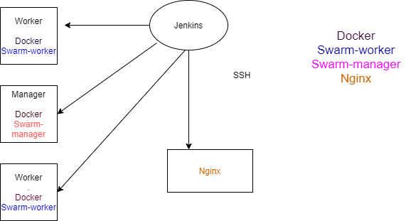

# Prize Generator

Author: Ayona Duncan

# Project Scope

A service-orientated architecture that 
generates a prize depending on your account number that was generated 
and is composed of at least 4 services that work together.

**Service #1**

The core service – this will render the Jinja2 templates 
 that interact with the application, 
 it will also be responsible 
 for communicating with the other 3 services, 
 and finally for persisting some data in an SQL database.

**Service #2 + #3**

These both generate a random “Object”, that respectively generates a: 

- range of random numbers

- range of random letter

**Service #4**

This service creates an “Object” based upon the results of service #2 + #3 
that allocates 50% of the cash prize if there is a 
4 or the letter starts with 'a' in your account number
. The other implementation 
generates 25% of the cash prize if the user's 
account number has a 4 and the letter starts with an 'A'.

# Architecture 

Architecture - Flow Chart:

Setting up jenkins to create a swarm and Nginx as a load balancer:

**Service #2**

A text generator with 2 different implementations available:

- One that creates 4 char Strings of lowercase letters

- One that creates 2 char String of uppercase letters

**Service #3**

A number generator with 2 different implementations available:

- One that creates a 4-digit number.

- One that creates an 8-digit number.

**Service #4**

A prize generator with 2 different implementations available, 
in both cases the prize is determined by the char string and number
 generated above.

- One for when the service is feeling generous (bigger rewards)

- One for when the service is not feeling generous (smaller rewards)'

**User Journey:**

A page is loaded and an Account Number is generated, let's take the first implementation for example 
where I am feeling generous, for example the account number generates a combination of the four
letters and numbers and outputs “ABCD1234”.

Seeing as the first letter of the Account Number is “a” or 
if there is a "4" 
in the account number
 the user stands to win 50% 
 of the £10,000 cash prize, because we are feeling generous. 
There is also a chance to win 25% of the £10,000 
cash prize in the second implementation 
that generates 8 random characters and two numbers, 
if the first letter of the account number 
starts with an "A" and has a 4, for when
we are feeling less generous. All this is described in
 the logic of service 4.

# Work Progress

For project management I used a Trello board, below is my initial to do list.

Trello Board at the start of project:

Trello board during the project to refactor issues and new implementations:

Trello board now can be found in the link below with all the tasks being completed:

please find link attached https://trello.com/b/t1bVao8S/prize-account-number-generator

# Build 

Webhooks were used to trigger a jenkins 
job build automatically from this SCM whenever changes were pushed.

Setting the jenkins pipeline:

In the Jenkins file:
 - The build stage builds all the containers and images
 - The test stage tests the application is working properly using pytest
 - The push stage tags and pushes images to Dockerhub
 - Configuration management stage checks the swarm is working as it should
 - Deploy stage deploys the containers as a stack 
 

# Tech Stack
The tools and requirements used for this application to run are as follows:

🎁 Cloud Server and Database - GCP VM and GCP SQL Server 

🎁 Reverse Proxy/Load balancer - NGINX 

- Nginx is a web server which can also be used as a reverse proxy, 
load balancer, mail proxy and HTTP cache.
The goal behind NGINX was to create a fast web server 
for handling a large amount of 
concurrent connections.
An NGINX reverse proxy server sits in front of web servers and 
forwards client
 requests (e.g. web browsers) to those web servers.
 Reverse proxies are typically implemented to help increase security, 
 performance, and reliability.

🎁 Programming Language - Python (Flask micro-framework)

🎁 CI Server - Jenkins

- Jenkins Pipeline is a user-defined model of a CD pipeline.
 My Pipeline was achieved using a Jenkinsfile 
 which includes stages for building an application,
  testing it and then delivering it. 
  This was subsequently committed to this SCR which means that 
the configuration is portable across different machines.

Benefits Include:

**.** Configure the build configuration to evolve as your code 
evolves by managing this with your SCM

**.** Do not have to create several shell scripts. 
Automatically creates a pipeline 
build process for all branches and pull requests

**.** There is a trail of commits 
so you can track where things went wrong

**.** If there are multiple people working on a project, 
they do not need access to your VM, they automatically
have access to your Jenkinsfile and can view and edit it accordingly.

🎁 Markup Languages for Front-end -  Flask(HTML)

🎁 Webhooks

- Webhooks were used so that whenever there is a change in the code base 
jenkins automatically triggers a new build 
 that recreates and redeploys the new changes pushed 
 to the SCM(this Github) and it 
 does this by sending a HTTP POST request to the jenkins server.

🎁 Containerisation Tool - Docker/Compose 

- Docker compose was used to streamline the process of having to use 
several Docker CLI commands to declare what docker resources we want 
which takes longer and creates room for human error. 
A Docker Compose file achieved this by allowing me to 
define and run multiple Docker containers with a single command 
through a single configuration file that specifies the deployment.

Benefits include:

**.** Build multiple images/containers with one command

**.** Easy to read and edit

**.** Automatically puts your containers into a network

**.** Containers are deployed as services

🎁 Orchestration Tool - Docker Swarm

- A container orchestration tool which is used to run a 
network of containers across multiple host machines, 
also known as nodes.
Nodes are grouped together in clusters 
of managers and workers. Manager nodes manage the Swarm 
while the worker nodes merely host containers. The
containers in a Swarm are run as services, 
and are therefore all replicas of each other, 
which thereby provides redundancy 
and high availability to the applications. 
It also allows for the deployment of the
 containers at scale. 

Benefits include:

**.** Easily scale up/down containers 

**.** Replicate containers for increased redundancy and improved resiliency

**.** Deploy containers across multiple machines (nodes) 

**.** Load balancing between containers 

**.** Dynamically re-allocate containers across nodes 

**.** Rolling updates can be done without stopping 
or restarting any containers 

🎁 Configuration management - Ansible Playbook

- A configuration management tool that is declarative in that
I declare the end-state/desired state (in this case Docker, Docker Swarm
and Nginx)

Ansible connects to other machines via ssh in the configuration 
management stage in Jenkins.

The playbook joins worker nodes and initialises the
manager node to ensure that the swarm is configured correctly.

Benefits include:

**.** Gets rid of environment drift(example an update) by making
desired/end state idempotent(stops them drifting) by using playbooks.

🎁 Open source repository management - Dockerhub

- Used to proxy, collect, and manage dependencies,
 so that you are not constantly 
juggling a collection of Docker images. 
Cached artefacts, so that, after the first build, 
the project will consult the cache before downloading anything. 

Benefits include:

**.** Docker Hub is publicly accessible, 
enabling a vast community of Docker developers to 
create and upload images 
that you can easily build your own from.

**.** Registries have the ability to execute webhooks 
to trigger deployments when an image has been successfully uploaded to it

**.** Using local copies of commonly used images is more efficient 
and speeds up deployment.

🎁 Docker Stack 

- My application was deployed using docker stacks.
Stacks were used to be able to deploy multiple services 
in a Swarm at once from a single configuration file.
It does this by making use of the 
 use the same docker-compose.yaml 
files. Stack pulls the images from my Docker Hub. 
This is because, as a part of Docker Swarm, 
it will run its containers across 
multiple nodes in the cluster. 
It therefore needs a central location to pull its images from.

Benefits include:

**.** Can easily perform rolling updates across multiple services, 
i.e. an update that rolls out gradually to replace 
outdated containers with updated versions, 
resulting in minimal to zero downtime.

**.**  Users of the application will experience little to no downtime 
as while the application is being updated. Both the old and new 
versions will be accessible until the new version has been 
fully rolled out across the Swarm.

🎁 VS Code

🎁 Operating System - Linux

See requirements.txt file for a full list of all requirements

# Testing

Testing was done with Pytest and the jenkins file was set to 
run the tests and test coverage as well as generate a
 report on the missing tests for each test. This was done so 
that testing can be shown during deployment and to ensure 
that a broken version
was not deployed to production, thereby ensuring that the 
application set out for deployment has been accurately and thoroughly tested. 

Test analysis:

. All applications were tested using unit testing, meaning that
each service and component of the software was tested individually 
using separate test files to confirm that each unit of the software code
was performing as expected. Testing was done using pytest.

. Unittest Mock has a method called Patch which changes
how the function operates because service two and three
 generate random number and random letters
 this would have been difficult to test fully, 
 as there are a range of different possible 
 outcomes each time the function is used. Therefore
I used mock so that the response 
from this function is one specific number or letter every time.

. requests-mock was used to provide a building 
block to stub out all the HTTP requests that 
were used for service one and service four to 
be able to test whether the get requests was getting that URI.
requests-mock allowed me to predefine responses 
when certain URI's are called.

. Tested whether service two and three 
were producing the correct length of numbers and letters
by checking that the 
length was equal to the range specified in each service. This way we
are testing whether our application is doing what we expect it to do.

. Tested whether the get requests responded to get requests with a successful 
status code equating to 200.

**How the tests could have been better:**

. Should have tested the if else statement in service four. To test whether it would return 
the object depending on the account-number generated. For example the different messages for when you
win and when you do not and what amount of the cash prize you stand to win.

. Should have tested whether the data generated is being stored in the database 

Test Coverage: 

The tests were refactored to suit the application with different implementations in place and the 
test coverage was the same:

Test Coverage: 95%

# Risk Assessment 

 Risk assessment at the start of project:
 
 
 
 
 
 Risk assessment at the end of project:
 likelihood for all are now low by implementing the control measures listed. 
 
 
 
 
 
# Contributors

Special thanks to Harry Volker
whose guidance was immensely helpful.

# References
https://www.w3schools.com/

QA community DevOps learning

https://pypi.org/project/requests-mock/

# License 
This project is licensed under the terms of the MIT license

